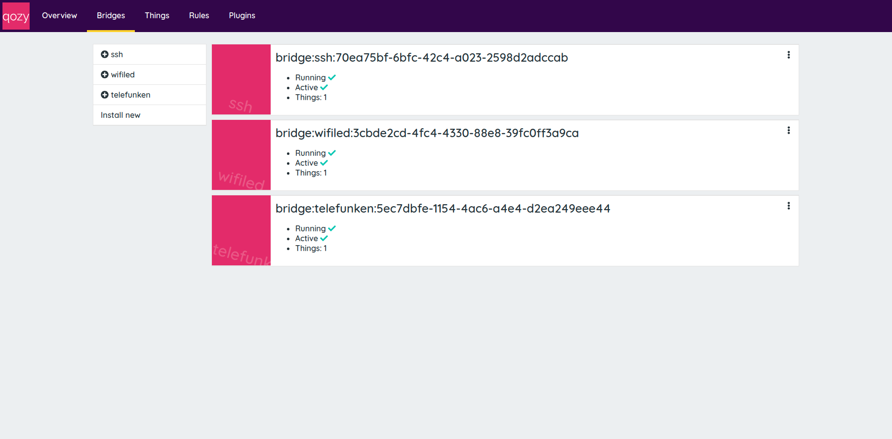
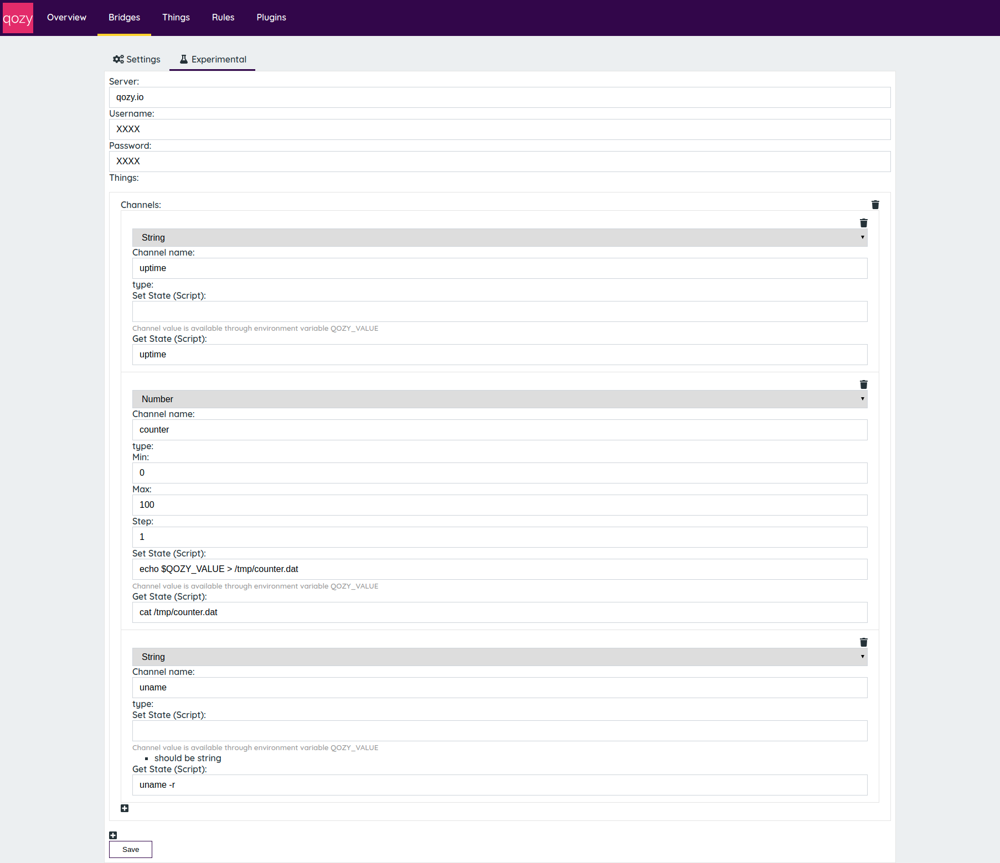
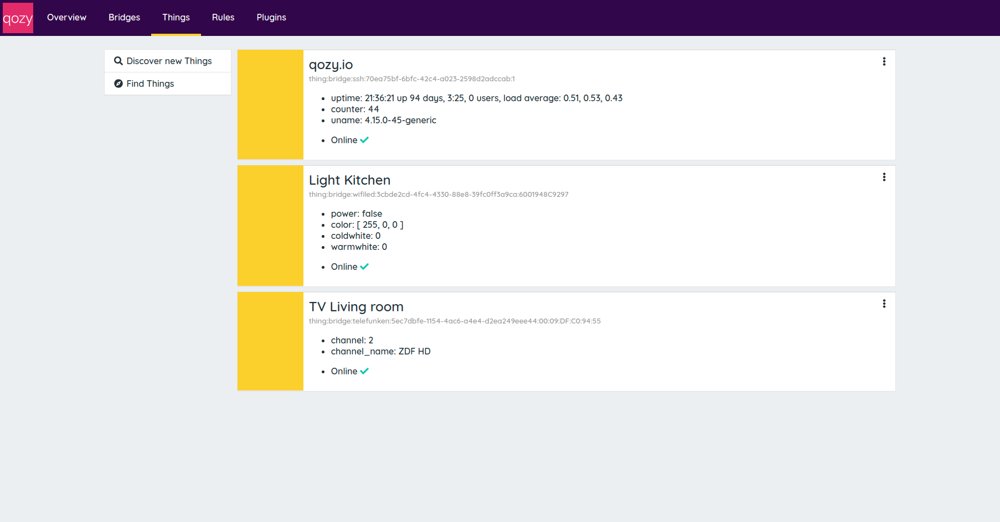
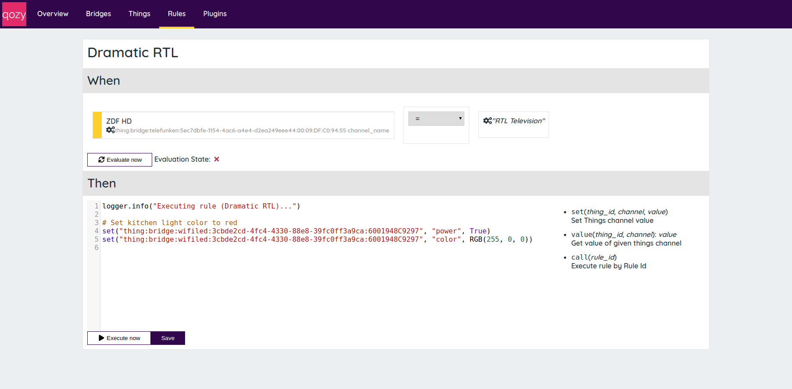

# qozy

<h1 align="center">

</h1>
<h4 align="center">Dead simple home automation solution</h4>

qozy is a software for home automation, it enables a manufacturer-independent control of various devices.

**qozy is still in development, productive use is strongly discouraged**

## Installation

```sh
$ pip install --index-url https://pypi.qozy.io "qozyd[full]"
```

## Usage

```sh
$ qozyd
```

Open `http://localhost:9876/ui/`in your browser.

## Overview

### Bridges





Management of bridges

### Things



Overview of all available things and their current state

### Rules



Simple configuration of rules via Web UI

## Features

- [x] Manufacturer-independent device control
- [x] Web UI based configuration
- [x] Plugin interface for connecting new devices
- [x] Rule-based control of devices
- [ ] Many supported device types
- [ ] Alexa/Google Home ready

